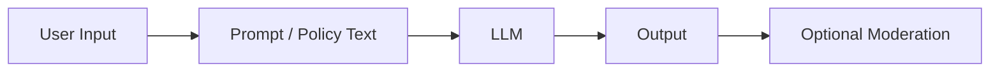
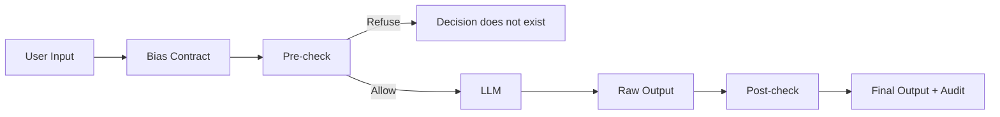

# Bias Contracts: Governance for LLM Decisions

## Why AI failures are usually failures of intent, not intelligence

Modern AI failures are rarely caused by models doing something *unexpected*.

They are caused by organizations refusing to be explicit about what they were willing to allow.

When an AI system produces a harmful or biased outcome, the post-mortem usually sounds the same:

- “The model hallucinated”
- “The data was biased”
- “The prompt wasn’t specific enough”
- “This was an emergent behavior”

Responsibility dissolves into a cloud of abstractions.

This is not a technical failure.  
It’s a **governance failure**.

---

## The accountability gap in AI systems

Most AI systems today operate in this pattern:

Governance, if it exists at all, happens **after** the decision is already made.

If intent is never declared *before* execution, it cannot be enforced *after* harm.

---

## Why existing governance approaches fall short

### 1. Prompt-level policy

Prompts are advisory, not enforceable.  
LLMs are probabilistic systems.  
A prompt is not a contract.

### 2. Model-level alignment

Alignment is averaged across contexts.  
Governance is domain-specific.  
Intent changes faster than models can be retrained.

### 3. Post-hoc moderation and audits

Once a decision exists, organizations fall back to explanation instead of accountability.

Explanation without prior commitment is just justification.

---

## The missing layer: ex-ante governance

Governance must happen **before** a decision exists.

| Question | Timing |
|--------|-------|
| Is this output acceptable? | Post-hoc |
| Was this decision allowed to exist? | Ex-ante |

---

## Introducing Bias Contracts

A **Bias Contract** is an explicit, versioned declaration of what an automated system is allowed to consider, ignore, or refuse *before* it makes a decision.

Bias Contracts are:
- Ex-ante
- Explicit
- Immutable once active
- Refusal-capable
- Auditable

Bias Contracts do not eliminate bias.  
They eliminate **hidden bias**.

---

## How Bias Contracts change the execution model

---

## Bias is not fairness

Fairness is an outcome property.  
Bias Contracts are an intent property.

A system may comply with a Bias Contract and still produce unfair outcomes.

That does not indicate failure.  
It indicates insufficient declared constraints.

---

## Refusal as governance

A system that cannot refuse is not governed.  
It is merely optimized.

---

## Auditability is not logging

Logging explains what happened.  
Auditability explains *why it was allowed*.

Bias Contracts produce decision artifacts, not logs.

---

## Covenant: a reference implementation

Covenant is an open reference implementation of Bias Contracts.

It validates contracts, enforces refusal and redaction, and produces audit artifacts.

It does not guarantee fairness.  
It guarantees accountability.

Repository: https://github.com/YuryTinos/covenant

---

## Scope and honesty

Bias Contracts do not solve ethics.  
They force explicit responsibility.

---

## Why this matters now

Organizations already encode bias implicitly.

The question is whether we are willing to be explicit—and accountable—for the bias we allow.
